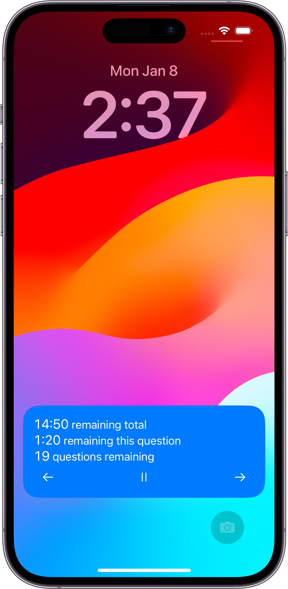
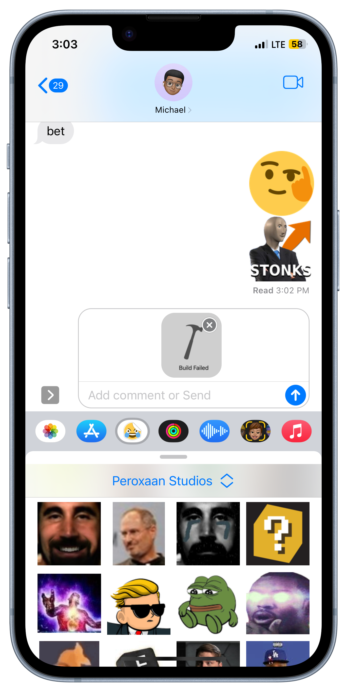
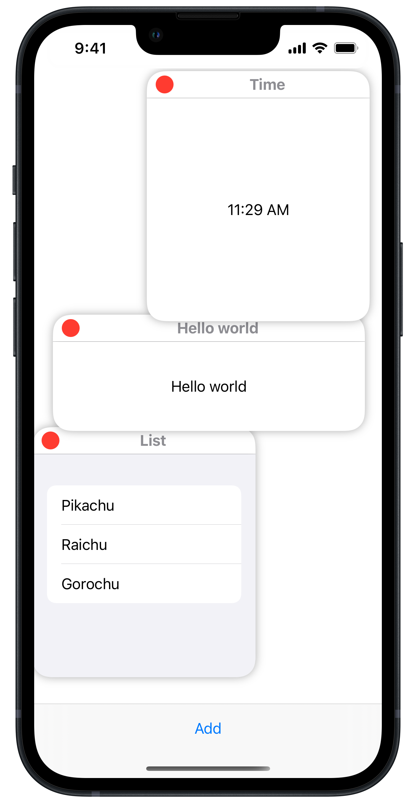

# [Andy Lin](https://github.com/andylin2004)

## Project Portfolio

### [Haptiphones](https://github.com/andylin2004/sldp-audio-processing)
A RAD project targeted at deaf people created for EG1004's Semester Long Design Project. This project involved adding a set of vibration motors to a preexisting pair of headphones, connecting the motors to a power source and a Raspberry Pi 4, and programming the Raspberry Pi so that it could process music sent to the Raspberry Pi and make the vibration motors vibrate to the currently playing music.

### [Tides App](https://apps.apple.com/us/app/tides-high-and-low-tide-info/id1583238971)
An app for iOS, iPadOS, and watchOS devices specifically designed for watercraft users to know tide conditions and when the tides will change. Widgets are also available for users to view this information on their Home Screen or Lock Screen (on iOS and iPadOS) or on their watch face (on watchOS).

### [Test Timer](https://apps.apple.com/us/app/test-timer-monitor-your-time/id1568837510)
An iOS, iPadOS and Mac Catalyst app designed to help students change their test taking habits for tests where people cannot go back to a question once the question is answered.

<table>
    <tr>
        <td>
        
        </td>
        <td>
        
        </td>
    </tr>
</table>

### [Low Power Mode Toggler](binaries/Low%20Power%20Mode%20Toggler.zip)
A macOS Menu Bar Extra App that allows MacBook owners to toggle Low Power Mode from the menu bar without having to dig through System Preferences for the Low Power Mode toggle. Also supports notifying the user that they can enable Low Power Mode when the MacBook goes down to 20% health (if notifications are enabled).

<!-- ### [StickerCord](https://apps.apple.com/us/app/stickercord/id1661981599) -->
### StickerCord
An iOS, iPadOS, and Mac app that allows users to use a Discord server’s stickers and emojis outside the Discord app. On iOS and iPadOS, users can also use the emojis and stickers as iMessage stickers.

<table>
    <tr>
        <td>
        
        </td>
        <td>
        
        </td>
    </tr>
</table> 

### Roblox Asset Uploader
Another soon to be released app for iOS and iPadOS devices targeted at allowing users to upload assets such as decals to the Roblox library through a native, robust user interface.

### [Roblox Studio Mobile](https://github.com/andylin2004/RobloxStudioMobile)
A side project to attempt to port features of Roblox Studio onto the iPadOS platform.

### [windows-swiftui](https://github.com/andylin2004/windows-swiftui)
An experiment in creating a windowing system within SwiftUI. However, since the App Store doesn't allow for individual windows within an app itself, this will probably never be used to create an actual app.

## Open Source Projects I Contributed to

### Reminders Menu Bar

- [Contributed to implementing a way to set a due date and time to a reminder.](https://github.com/DamascenoRafael/reminders-menubar/pull/80)

### OpenBVE
- [Improved the handling of setting the size of the simulator window.](https://github.com/leezer3/OpenBVE/pull/692)
  - The PR was closed but the feature was [implemented](https://openbve-project.net/intro/v1.8.2.0/) through a proper NuGet package since macOS doesn't support compilation of packages.

### OpenTK
- Helped other contributors fix the implementation of detecting the display scaling of a screen. 
  - [#1](https://github.com/leezer3/opentk/pull/1)
  - [#2](https://github.com/leezer3/opentk/pull/2)