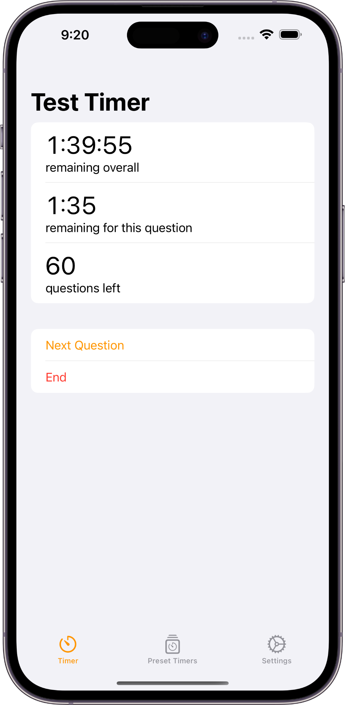

# [Andy Lin](https://github.com/andylin2004)

## Hi there 👋

I'm Andy, a student at Stuyvesant High School and developer from New York, NY. The majority of my repos here as of right now are from my high school computer science classes, although I do have a few side projects here. I usually program in Swift, Python, and Rust, although I also have experience programming in Java, C, C#, and Luau (Roblox's fork of Lua).

## Coursework

- Stuyvesant High School's Annual Computer Science class
- [APCS AB](https://github.com/andylin2004-apcs)
- [Software Development](https://github.com/andylin2004/SoftDevWorkshop)
  - [Project 0 (blog site using Flask, SQLite)](https://github.com/andylin2004/softdev-P00)
  - [Project 1 (dashboard site with a CSS framework)](https://github.com/markzhu926/Team-Ye_Fanboys-p01)
- [Systems Level Programming](https://github.com/andylin2004-systems)
  - [Final Project](https://github.com/ywu20/sockemfia)

## Portfolio of Personal Projects

### [Test Timer](https://apps.apple.com/us/app/test-timer-monitor-your-time/id1568837510)
An iOS, iPadOS and Mac Catalyst app designed to help students change their test taking habits for tests where people cannot go back to a question once the question is answered.

<table>
    <tr>
        <td>
        
        </td>
        <td>
        
        </td>
    </tr>
</table>

### [Low Power Mode Toggler](binaries/Low%20Power%20Mode%20Toggler.zip)
A macOS Menu Bar Extra App that allows MacBook owners to toggle Low Power Mode from the menu bar without having to dig through System Preferences for the Low Power Mode toggle. Also supports notifying the user that they can enable Low Power Mode when the MacBook goes down to 20% health (if notifications are enabled).

### Tide Tracker
A soon to be released app for iOS and iPadOS devices specifically designed for watercraft users to know tide conditions and when the tides will change.

<table>
    <tr>
        <td>
        
        </td>
        <td>
        
        </td>
    </tr>
</table>

### Roblox Asset Uploader
Another soon to be released app for iOS and iPadOS devices targeted at allowing users to upload assets such as decals to the Roblox library through a native, robust user interface.

### [Roblox Studio Mobile](https://github.com/andylin2004/RobloxStudioMobile)
A side project to attempt to port features of Roblox Studio onto the iPadOS platform.

### [windows-swiftui](https://github.com/andylin2004/windows-swiftui)
An experiment in creating a windowing system within SwiftUI. However, since the App Store doesn't allow for individual windows within an app itself, this will probably never be used to create an actual app.

## Open Source Projects I Contributed to

<!-- ### Reminders Menu Bar -->
### OpenBVE
- [Improved the handling of setting the size of the simulator window.](https://github.com/leezer3/OpenBVE/pull/692)
  - The PR was closed but the feature was [implemented](https://openbve-project.net/intro/v1.8.2.0/) through a proper NuGet package since macOS doesn't support compilation of packages.

### OpenTK
- Helped other contributors fix the implementation of detecting the display scaling of a screen. 
  - [#1](https://github.com/leezer3/opentk/pull/1)
  - [#2](https://github.com/leezer3/opentk/pull/2)

[Privacy Policy for Apps](Privacy.md)
